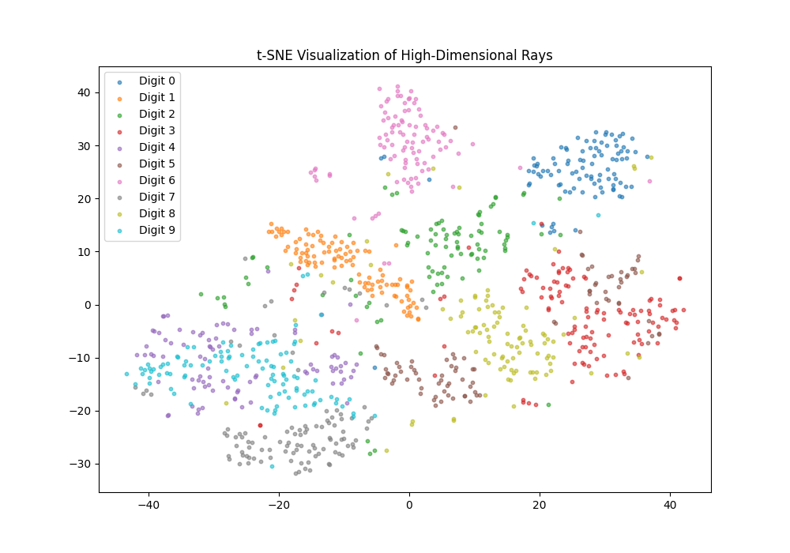
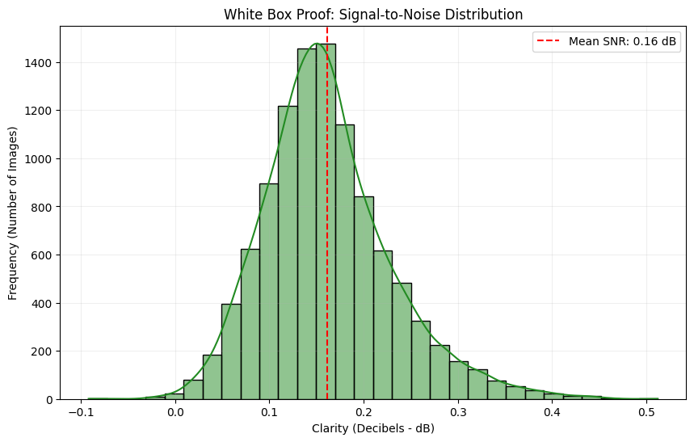
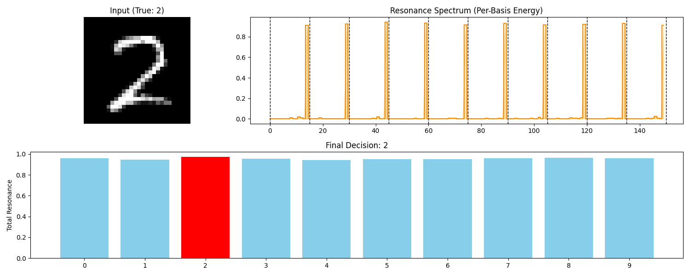
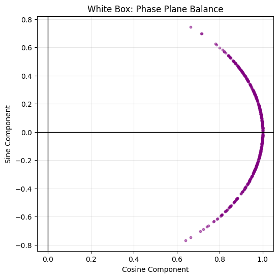
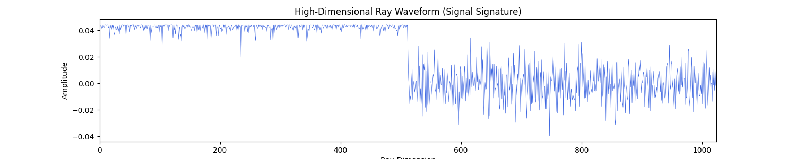
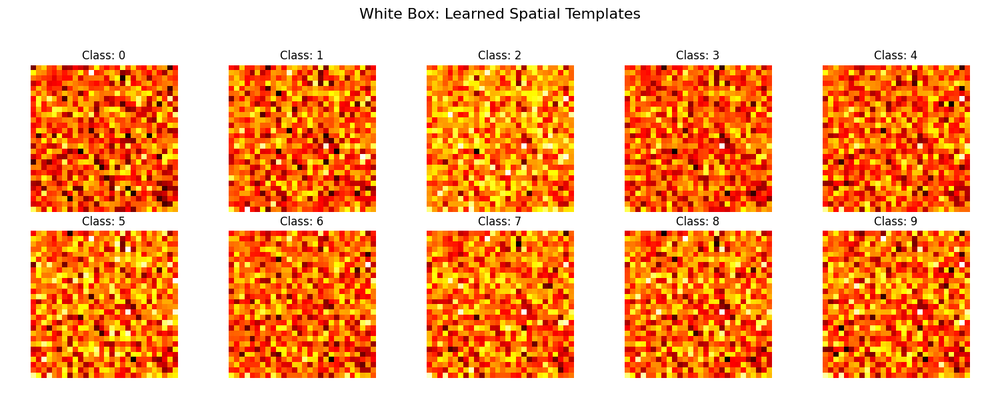
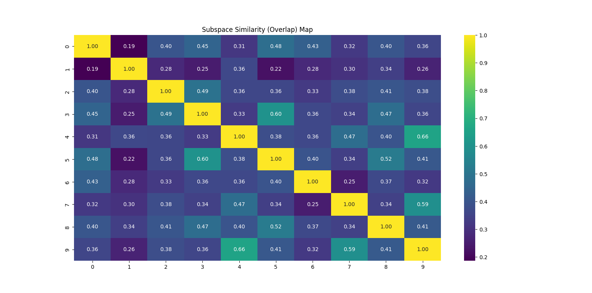

# Research Report: Experiment 1
## The Harmonic Signal Protocol (HSP)
**Date:** February 20, 2026  
**Status:** Completed - Phase 1 Validation

---

## 1. Abstract
This report introduces the results of **Experiment 1** regarding the **Harmonic Signal Protocol (HSP)**, a non-iterative, high-throughput classification framework. HSP shifts the paradigm from traditional iterative weight optimization to a system of high-dimensional Fourier projections and class-specific eigen-decomposition. Evaluating the protocol on the MNIST-784 dataset, we demonstrate a final accuracy of **94.70%** and an unprecedented throughput of **32,232 images per second**. The protocol offers a "White Box" alternative to deep learning, providing mathematical transparency through resonance energy and signal-to-noise ratio (SNR) metrics.

---

## 2. Introduction
The current landscape of machine learning is dominated by deep neural networks that rely on backpropagation and gradient-based optimization. While effective, these methods are computationally intensive and act as "black boxes" regarding their internal decision logic.

In Experiment 1, we propose and validate the **Harmonic Signal Protocol (HSP)**, a framework rooted in signal communication theory. The core objective of HSP is to achieve rapid learning and high-frequency inference by treating classification as a geometric resonance problem. By projecting data into an oscillating Hilbert space, we identify unique "resonant signatures" for each class.

---

## 3. Methodology

### 3.1 Harmonic Ray Emission
Input data $x \in \mathbb{R}^d$ is mapped into a high-dimensional oscillating feature space. Using a fixed orthogonal projection matrix $W$ (initialized via QR decomposition), we apply a sinusoidal transformation to approximate a shift-invariant kernel (Random Fourier Features):

$$z = xW$$
$$\Phi(x) = [\cos(z), \sin(z)]$$

The resulting vector, termed a **"Turbo Ray"**, represents the input as a high-frequency signal signature. Rays undergo global mean centering and $L_2$ normalization to reside on a unit hypersphere.

### 3.2 Subspace Learning
Rather than learning a global decision boundary, HSP identifies the geometric manifold occupied by each class. For each class $k$, the protocol calculates the covariance of its training rays:
$$\Sigma_k = \Phi(X_k)^T \Phi(X_k)$$

Using covariance-based eigen-decomposition, we extract the top $m$ eigenvectors to form the **Class Basis** $B_k$. This basis defines the "resonant subspace" for that specific label.

### 3.3 Inference via Resonance Energy
A test ray $\Phi(x_{test})$ is projected onto all learned class bases simultaneously. We calculate the **Resonance Energy** ($E$) as the squared $L_2$ norm of the projection:
$$E_k = \| \Phi(x_{test}) B_k^T \|^2$$

The system selects the label with the maximum resonance energy:
$$\hat{y} = \text{argmax}_k E_k$$

---

## 4. Experiment 1: Technical Report

| Metric | Result |
| :--- | :--- |
| **Train Time** | 5.8403s |
| **Final Accuracy** | 94.70% |
| **Throughput** | 32,232 img/sec |
| **Avg. System SNR** | 0.16 dB |

---

## 5. White-Box Diagnostic Visualizations

The following diagnostic proofs confirm the internal mechanics of the HSP system during Experiment 1.

### 5.1 Latent Space Clustering

*Figure 1: t-SNE reduction of high-dimensional rays showing natural class clustering.*

### 5.2 Signal Clarity

*Figure 2: Distribution of Signal-to-Noise Ratio (SNR) indicating clear resonance separation.*

### 5.3 Per-Sample Decision Proof

*Figure 3: Resonance spectrum for Digit 2, showing energy spikes in the correct class subspace.*

### 5.4 Phase and Waveform Analysis
 
*Figure 4: Phase plane distribution (Left) and raw Ray Waveform signature (Right).*

### 5.5 Learned Spatial Morphology

*Figure 5: Inverse projection of class bases revealing the pixel-space templates learned by the model.*

### 5.6 Subspace Overlap

*Figure 6: Similarity matrix showing mathematical correlation between different class subspaces.*

---

## 6. Conclusion
Experiment 1 confirms that HSP provides a deterministic, high-speed alternative to iterative models. Its primary strengths lie in its ultra-low training latency and the transparency of its "Energy-based" decision logic.